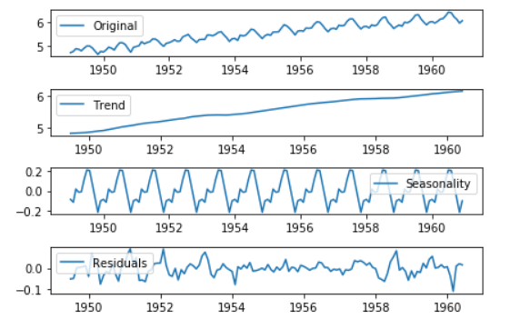
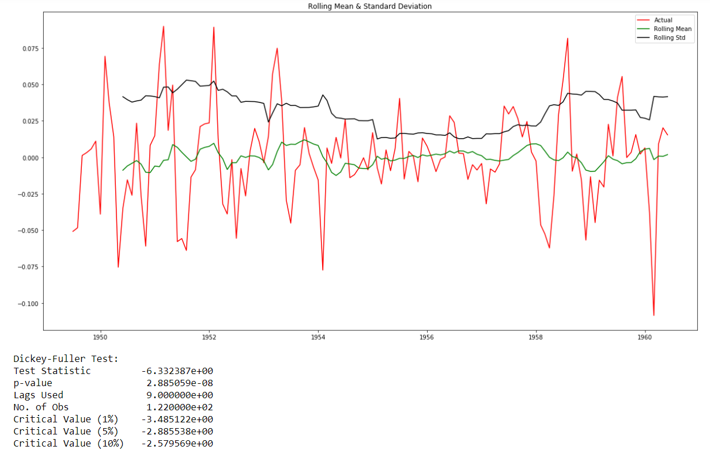
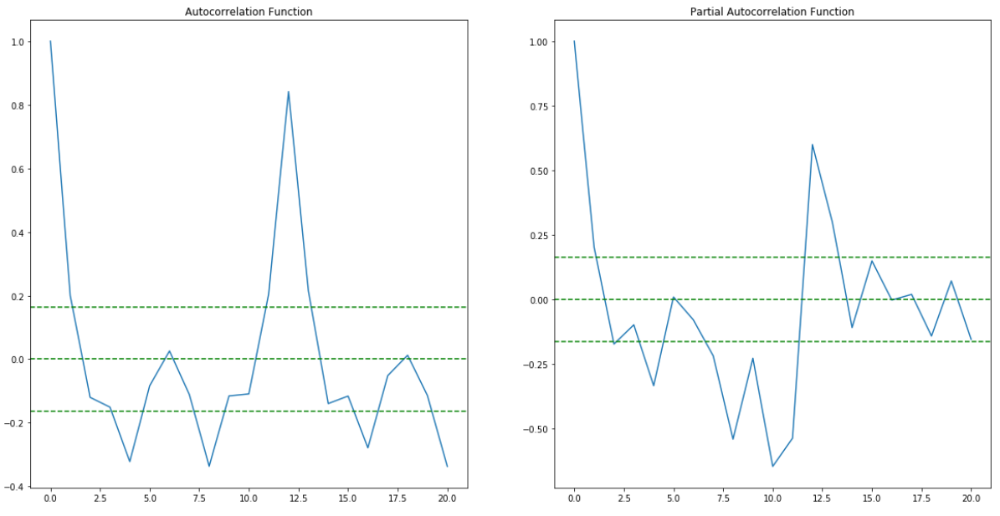
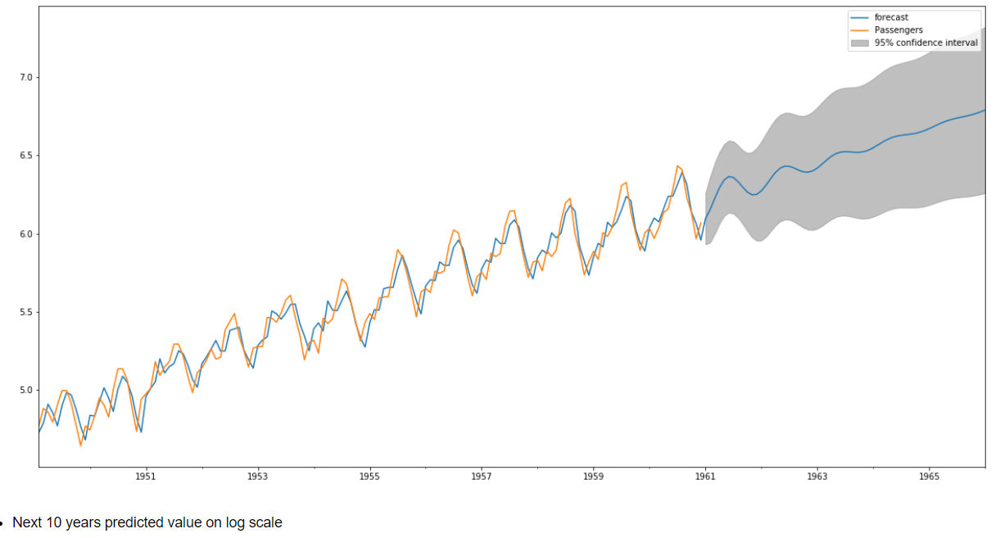

# Airlines-Passenger-Forecasting-Time-Series-Analysis
Forecasting number of passengers for airlines using ARIMA model in Python.
   
## Table of contents

* [General info](#general-info)
* [Screenshots](#screenshots)
* [Contact](#contact)

## General info

Project was Time Series Analysis, used ARIMA method to build the model.
Major steps involved were as follow :                                 
* STEP: 1 - Data Cleaning and Analysis
* STEP: 2 - Checking Stationarity (ADF Test) 
* STEP: 3 - Transformation  
* STEP: 4 - Differencing
* STEP: 5 - Time Series Components 
* STEP: 6 - Finding ACF and PACF
* STEP: 7 - ARIMA Modeling 
* STEP: 8 - Model Evaluation

## Screenshots

## Contact
If you loved what you read here and feel like we can collaborate to produce some exciting stuff, or if you
just want to shoot a question, please feel free to connect with me on 
<a href="https://www.linkedin.com/in/hemanshanand" target="_blank">LinkedIn</a>

